## Hướng dẫn chạy ứng dụng
**1. Cài đặt Jupyter Notebook**
* Yêu cầu cài đặt [Python](https://www.python.org/downloads) (Chọn Add to PATH) và [.NET 8 SDK](https://dotnet.microsoft.com/en-us/download/dotnet/8.0)
* Truy cập [trang chủ](https://jupyter.org/install) để biết thêm chi tiết về jupyter
* Bật **powershell** hoặc **cmd**
* Chạy hoàn tất lần lượt các lệnh dưới đây (yêu cầu cài đặt môi trường đầy đủ như trên) 
    * **pip install jupyterlab**
    * **pip install notebook**
    * **dotnet tool install -g Microsoft.dotnet-interactive**
    * **dotnet interactive jupyter install**
* Sau đó, chạy tiếp lệnh "**jupyter lab**" để kiểm tra. Nếu Notebook đã có [.NET interactive](https://github.com/dotnet/interactive?tab=readme-ov-file#jupyter) thì thành công.
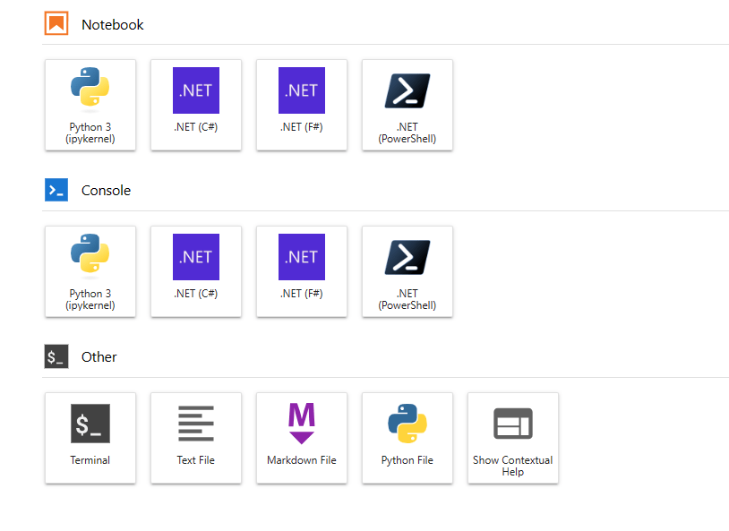

**2. Chạy jutyper notebook bằng terminal** 
* Clone project về máy cá nhân.
* truy cập vào nơi clone project, mở **cmd** hoặc **powershell**
* Chạy tiếp lệnh "**jupyter notebook**"
* Sau đó, chọn file **ML.NET.ipynb**, Chọn **Open**
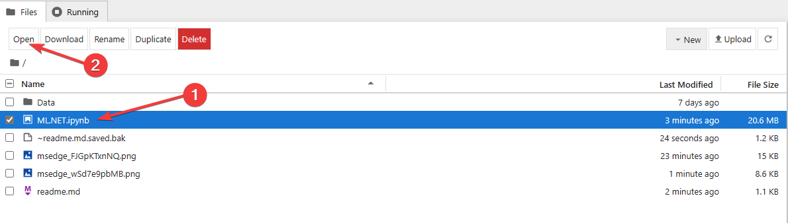
* Tải dữ liệu mẫu về tại [**đây**](https://drive.google.com/drive/folders/11UvXUBdkBUg94E9ra5SI5kHLJjuADlxk). Paste vào thư mục [Data](Data). Dổi tên file trong notebook khớp với tên file vừa tải. Nếu muốn tự chọn dữ liệu, xem [phần 3](#phan-3)
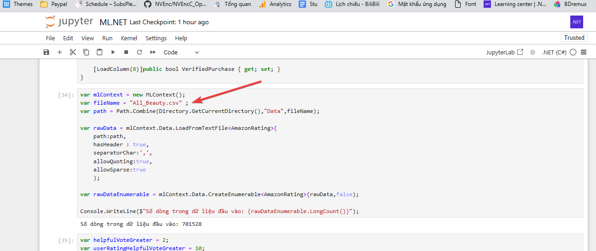
* Tiếp tục, chọn như hình để chạy toàn bộ file
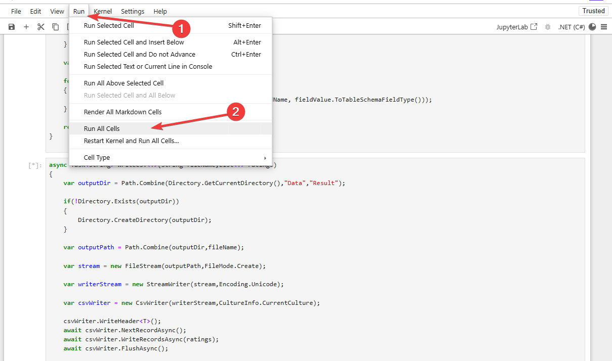
* Quan sát tiến độ, chờ hoàn tất
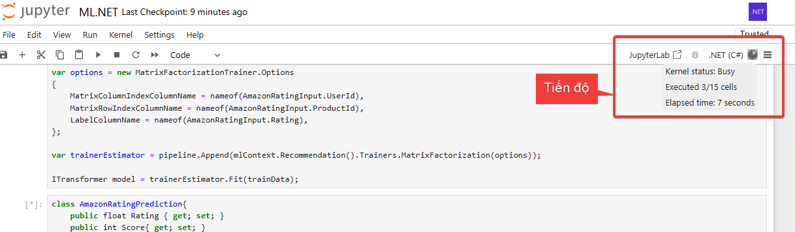
* Kết quả sau khi hoàn tất chạy
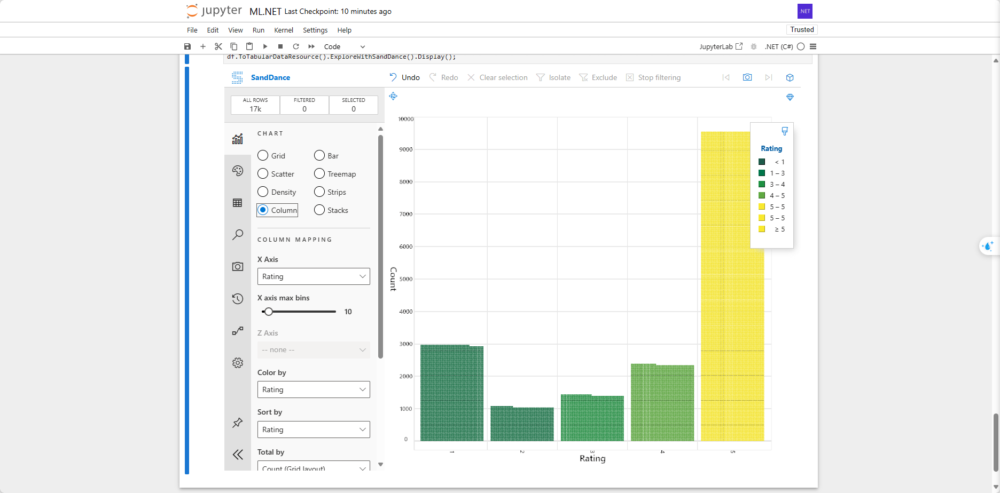
>**Có thể sử dụng Visual studio code, Pycharm, ... để chạy jupyter**
* Hoàn tất

[**3. Xử lý dữ liệu đầu vào**](#phan-3)
> * Mặc định, project có sẵn tệp dữ liệu đầu vào đã qua xử lý. Nếu cần làm khâu xử lý dữ liệu, vui lòng xem phần này

* Dữ liệu được lấy từ [**Amazon Product Review 2023**](https://amazon-reviews-2023.github.io/#grouped-by-category)
* Tải dữ liệu phần **review**, dựa vào **#User**, **#Item**, **#Rating** để lựa chọn dữ liệu phù hợp. 
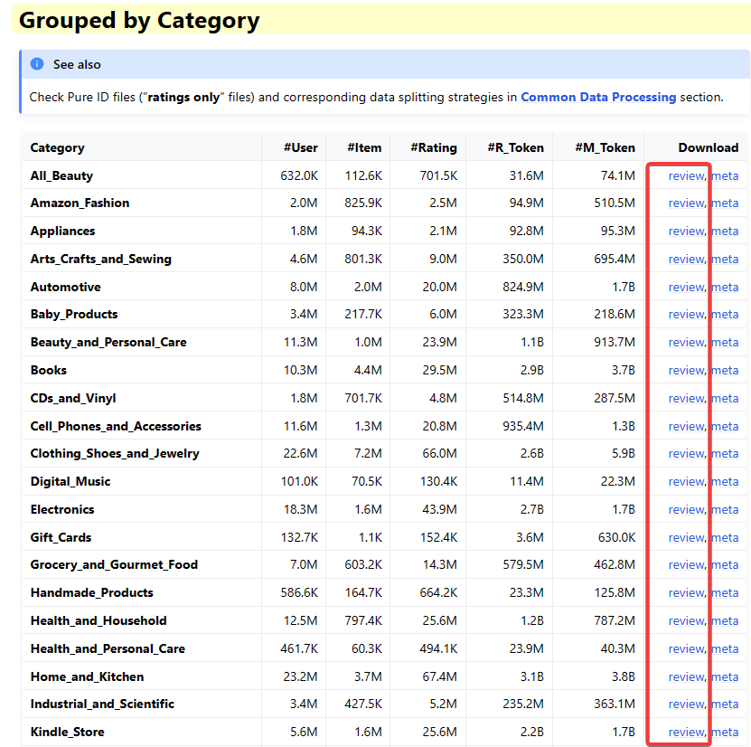
* Sau khi tải xong, ta có được file .gz. Giải nén ra được file .jsonl chứa rất nhiều Json object bên trong. File **All_Beauty.jsonl** chứa hơn 700000 dòng, tương ứng hơn 700000 đánh giá về sản phẩm làm đẹp.
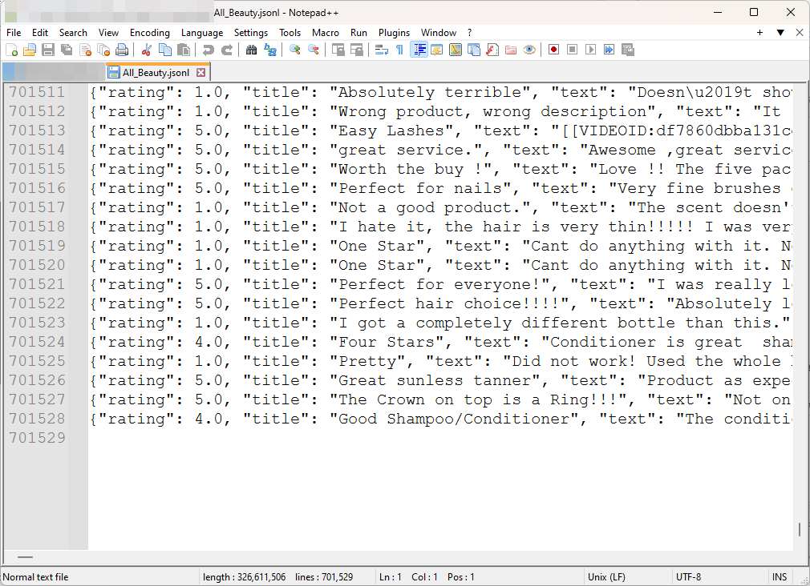
* Sau khi có file .jsonl, ta sẽ chuyển file này về file .csv để tiện sử dụng trong project này hoặc nhiều project khác nữa.
* Truy cập project đã clone, truy cập thư mục [**Tools**](Tools)
* Bật terminal, sử dụng **JsonLToExcel-x64** hay **JsonLToExcel-x86** tuỳ vào hệ điều hành.
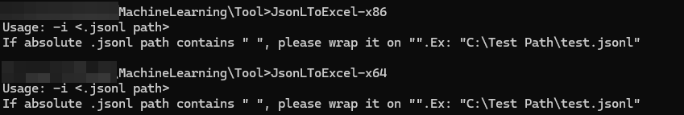
> **Sử dụng hệ điều hành khác? Build lại tại [đây](https://github.com/TalonEzio/ExportJsonLargeToExcel)**
* Cách sử dụng: JsonLToExcel-x64.exe -i ".jsonl file"
    * **Ví dụ:** JsonLToExcel-x64.exe -i "C:\\Test\\Test 123\\file.jsonl"
    > Tool chỉ nhận file từ [Amazon Product Review](https://amazon-reviews-2023.github.io/#grouped-by-category), file .jsonl khác không hiệu quả
* Sau khi chạy hoàn tất, ta có file .csv cùng thư mục file .jsonl. Di chuyển file này vào thư mục **Data**
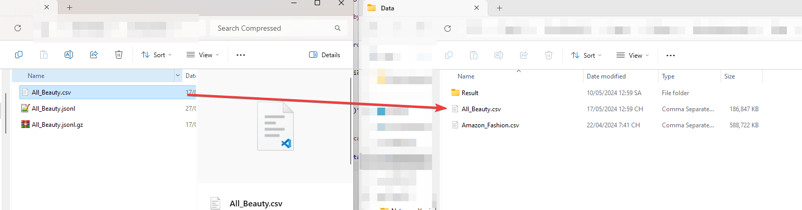
* Vào jupyter notebook, sửa tên file theo đúng với tên tệp trong thư mục
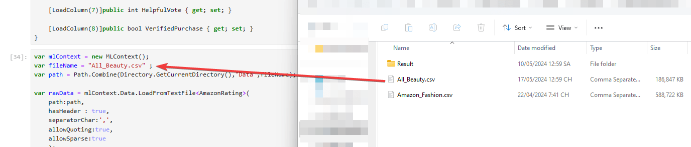
* Hoàn tất!
